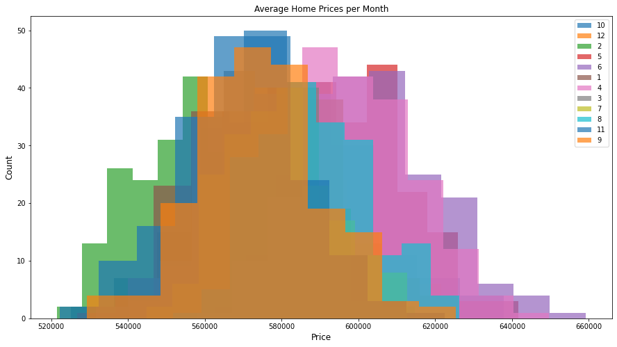
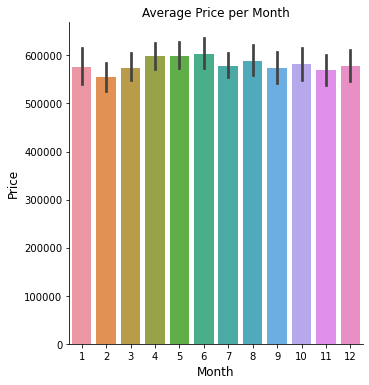
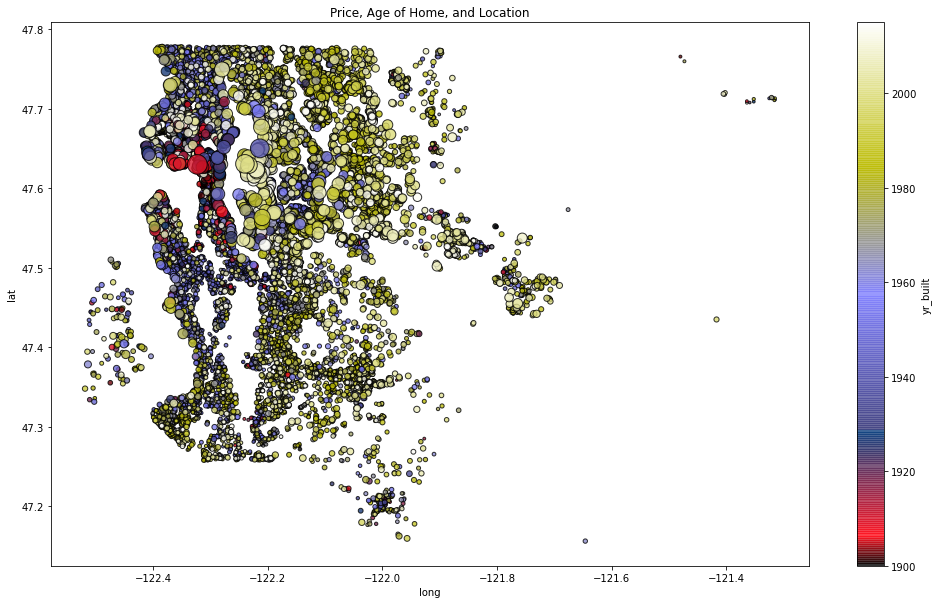
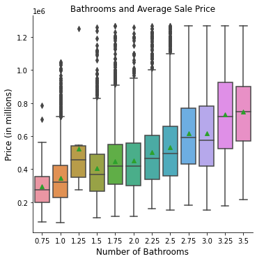
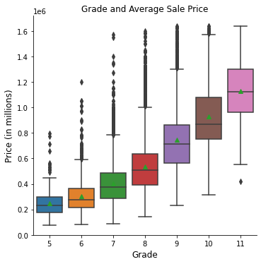
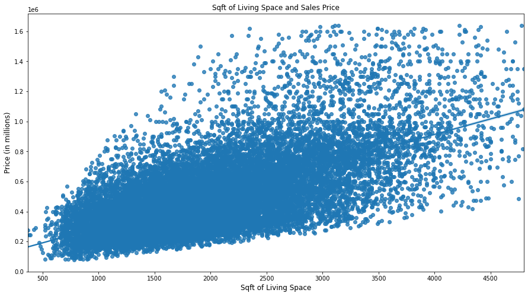

# Housing Costs in King County

Our second project focuses on statistics and linear regression to help us improve our skills at finding, isolating, and evaluating evidence to help reach informative conclusions. We were provided past data from King County about housing sales. With this in mind, I wanted to figure out to use this information to help potential home buyers figureout a direction to help them find a home. 

The price of a home in Western Washington has increased exponentially over the past 10 - 15 years. As a result, it is harder and harder to find an affordable house if somene doesn't have an annual income of around 80,000 dollars. 

By using libraries such as matplotlib, seaborn, and techiniques such as simple and multiple linear regressions, I hope to bring some insight into a new prospective homebuyer to see if I can help move them forward in their home buying journey.  

### Data and Technologies Used

This project uses the King County House Sales dataset from 2014 - 2015. 

The following language and libraries were used for this project:

* Python
* Matplotlib
* Seaborn
* Pandas
* Numpy
* Statsmodels
* Scipy

The provided data set gave us the following housing information:

* date
* price
* bedrooms
* bathrooms
* sqft_living
* sqft_lot
* floors
* waterfront
* view
* condition
* grade
* sqft_above
* sqft_basement
* yr_built
* yr_renovated
* zipcode
* lat
* long
* sqft_living15
* sqft_lot15

For this project, I will be looking at comparing our target variable (sales price) with living space (sqft_living), grade, and number of bathrooms. There will also be mentions about the year the house was built (yr_built) and locational correlations (lat and long) with our target value. 

### Questions to be answered:

- When is the best time to buy a home?
- Where is the best place in King County to buy a home?
- How do various features such as number of bathrooms, grade of the house, amount of living space play impact the price? 

### Recommendations

Our first figure shows us that housing costs varies per month but they're going to be roughly around $500,000 - $600,000 dollars. Our second figure shows us the best time to buy is going to be around February. The average price of homes sold in Feburary is around $555,000. The worst time to buy is during spring and summer as the average prices of sold in April, May, and June are around $600,000.

This figure shows prices, age of the home, and locational data with bubble size representing price and colors representing when the house was built. It shows us location is correlated with your sales price. In general, buying a house north of the 47.5 latitude will be much more expensive than buying a house south of that latitude. Houses in the south of that latitude are substantially cheaper. 

### Number of Bathrooms, Grades, and Living Space

We started our analysis of these features with comparing bathrooms to the sales price.
1. We found a low R-Squared Value of 20%. This makes sense as there's only a certain number of bathrooms you can have in a home. 
2. For every home that has no bathrooms, the average cost is $188,000. With the increase of one bathroom, the price goes up by $144,000.
3. We were able to establish linearity with a P-Value of 0.56.

When adding in grades:
1. We increased our R-Squared Value to 46%.
2. Home prices increase by $179,000 for every grade.
3. We violated the linearity assumption by having a very small P-Value.

*** It is important to note that grades are subjective and therefore very difficult to establish linearity. However, it is still worth noting there is a 66% correlation between sales price and grade of a home.

Our final model included living space:
1. We increased our R-Squared Value to 49%.
2. For every sqft of living space, cost of a house increased by 128 dollars. 
3. We returned to linearity with a P-Value of 0.64

Based on our models, we were able to see number of bathrooms and grade do impact housing prices. However, they do to an extent. There's always a certain number of bathrooms a home can have. It is very rare to see a house have more than 3 bathrooms so there are limits to how much it can influence a home's price. Grade is has it's own correlation issues. Every grade is subjective and we are unsure of how homes are graded. Because of this, if a home is labeled a specific grade... the price could increase drastically. It also could be influenced by other things such as location. A home with a specific grade in the north could be worth $100,000 more than the same house and grade in the south. 

Living space shares a linear relationships with space. As you increase the size of your living area, your price goes up. This is also influenceed by location as well.

## Weaknesses of Data

User error was probably the biggest issues with the data. It was difficult to find ways of establishing linearity. As a result, two of our three models only passed the linearity assumptioned but failed normality, independence, and homoscedasticity.
1. This shows bias in our data.
2. We don't have strong evidence to infer there is specific relationships between the features and target variables. 
3. Causes difficulty using the data to predict trends in the future.

### What's Next?

We need to look deeper into other factors that play a role in housing price. 
1. Area - North vs. South, distance from schools/parks, average income of people in specific zipcodes
   - Big tech companies are located in the north, north and south streets have price differences
   - Do people who live in specific areas increase the price of houses in that area?
2. Other aspects of a home: include bathrooms, is it in near the water?, downtown versus suburbs?
3. Use a more recent time frame or a longer time frame. 
   - It is important to see if there are trends in data.